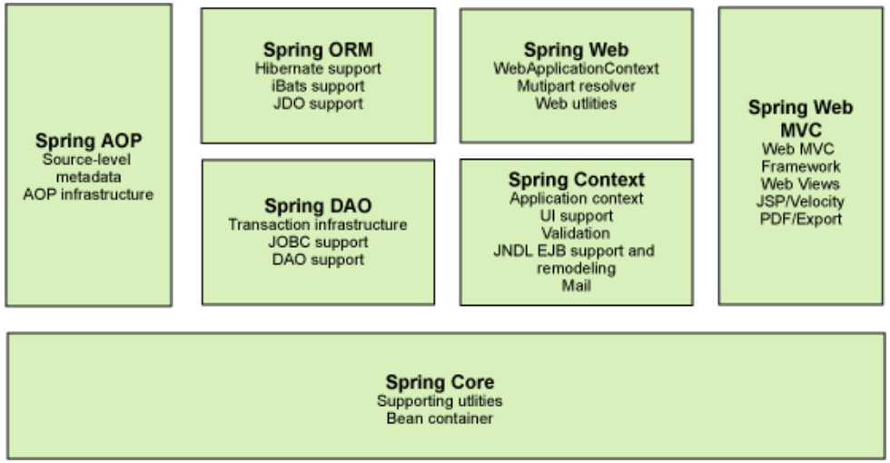
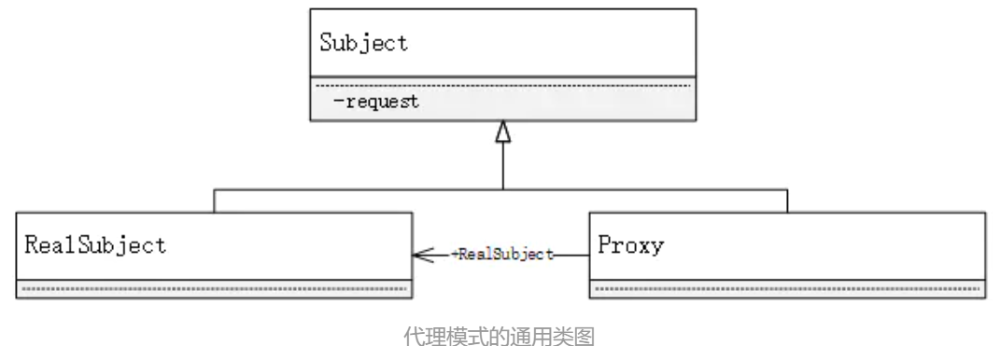
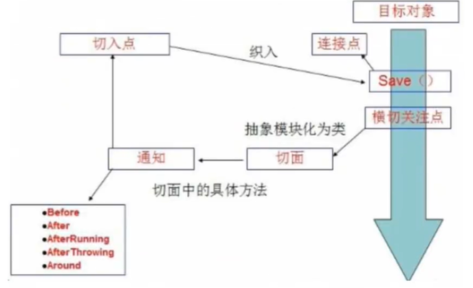

# 1.简介

> spring是J2EE应用程序框架，是轻量级的IoC和AOP的容器框架
>
> 为了解决企业应用开发的复杂性而创建的

2002年推出interface 21作为spring框架的雏形

2004年3月24日经过interface 21改良发布了spring框架

## 1.1理念

- 使现有的技术更容易使用，本身是一个大杂烩，整合了现有的技术框架

## .12相关

官网：https://spring.io/projects/spring-framework#overview

官方下载地址：https://repo.spring.io/release/org/springframework/spring/ 

GitHub：https://github.com/spring-projects/spring-framework

### maven依赖

```xml
<!-- https://mvnrepository.com/artifact/org.springframework/spring-webmvc -->
<dependency>
    <groupId>org.springframework</groupId>
    <artifactId>spring-webmvc</artifactId>
    <version>5.2.0.RELEASE</version>
</dependency>
<!-- https://mvnrepository.com/artifact/org.springframework/spring-webmvc -->
<dependency>
    <groupId>org.springframework</groupId>
    <artifactId>spring-jdbc</artifactId>
    <version>5.2.0.RELEASE</version>
</dependency>
```

## 1.3优点

- 开源的框架
- 轻量级**非入侵式**的框架  （引入了spring不会改变代码原来的情况）
- **控制反转(IOC)，面向切面编程(AOP)**
- 支持事务的处理，对框架整合的支持

# 2.spring组成和扩展

## 2.1spring七大模块

### Spring Core

核心容器：提供了spring框架的基本功能。

spring使用BeanFactory来产生和管理bean，他是工厂模式的实现

BeanFactory使用IOC将配置和依赖性规范与应用程序代码分开。

### Spring Context

spring上下文：向spring框架提供上下文信息

### Spring AOP

为基于spring的应用程序中的对象提供了事务管理服务。

使用AOP可以将声明性事务管理集成到应用程序中

### Spring Dao

对应持久层的解决方案，提供了JDBC，JDO等DAO层的支持

### Spring ORM

Spring框架插入了若干个ORM框架，从而提供了ORM对象的关系工具，其中包括了Hibernate、JDO和 IBatis SQL Map等，所有这些都遵从Spring的通用事物和DAO异常层次结构。

### Spring Web

　Web上下文模块建立在应用程序上下文模块之上，为基于web的应用程序提供了上下文。所以Spring框架支持与Struts集成，web模块还简化了处理多部分请求以及将请求参数绑定到域对象的工作。

### Spring  Web MVC

MVC框架是一个全功能的构建Web应用程序的MVC实现。

## 2.2Spring 扩展

.png)

* spring boot
  * 目的是用来[简化](https://baike.baidu.com/item/简化/3374416)新[Spring](https://baike.baidu.com/item/Spring/85061)应用的初始搭建以及开发过程
  * 一个快速开发的脚手架
  * 基于spring boot可以快速开发单个微服务
  * 约定大于配置
* spring cloud
  * 基于spring boot

# 3.IOC

## 3.1原先写一个项目

1. UserDao接口

   ```java
   public interface UserDao {
       void getUser();
   }
   ```

2. UserDaoImpl实现类

   ```java
   public class UserDaoImpl implements UserDao{
       @Override
       public void getUser() {
           System.out.println("默认获取用户的输出");
       }
   }
   ```

3. UserService业务接口

   ```java
   public interface UserService {
       void getUser();
   }
   ```

4. UserServiceImpl业务实现类

   ```java
   public class UserServiceImpl implements UserService{
   
       private UserDao userDao = new UserDaoImpl();
   
       @Override
       public void getUser() {
           userDao.getUser();
       }
   }
   ```

   > 缺点：由程序控制代码，需要由用户需求控制代码

   ### 改善

   添加一个set接口

   ```java
   public interface UserService {
       void getUser();
   
       void setUserDao(UserDao userDao);
   }
   ```

   ```java
   private UserDao userDao;
   
       @Override
       public void setUserDao(UserDao userDao){
           this.userDao = userDao;
       }
   ```

   将原本写死的Userdao，变为根据用户需求变换所变换的值

这种思想，从本质上解决了问题，我们程序猿不用再去管理对象的创建了。系统的**耦合性大大降低**~，可以更加专注的在业务的实现上！这是IOC的原型！

## IOC（控制反转）

> IoC全称Inversion of Control

IOC是一种设计思想，DI（依赖注入）是实现IOC的一种方法。

在面向对象编程中，对象的创建由程序自己控制，控制反转（IOC）后将对象的创建转移给第三方。

控制反转是一种通过描述（XML或注解）并通过第三方去生产或获取特定对象的方式。在Spring中实现控制反转的是IoC容器，其实现方法是依赖注入（Dependency Injection，DI）

.png)

> 降低程序耦合性，将他们都接入同一个第三方来达到降低耦合性的目的地

## 4.第一个Spring程序

使用spring创建对象，在spring中这些称为bean

一个bean相当于new一个对象

### 实例化容器

使用xml加载

获取spring的上下文对象

```java
ApplicationContext context = newClassPathXmlApplicationContext("beans.xml");

```

从容器中取出对象

```java	
 Hello hello = (Hello) context.getBean("hello");
```

>  对象由spring创建
>
> 属性由bean从创建

xml文件

```xml
<?xml version="1.0" encoding="UTF-8"?>
<beans xmlns="http://www.springframework.org/schema/beans"
       xmlns:xsi="http://www.w3.org/2001/XMLSchema-instance" xsi:schemaLocation="http://www.springframework.org/schema/beans
        http://www.springframework.org/schema/beans/spring-beans.xsd">
<!--
id = 变量名
class = new 的对象
property = 给对象中的属性设置值
依赖注入利用set方法进行注入

ref:引用spring容器中创建好的对象
value：具体的值，基本的数据类型
-->
    <bean id="hello" class="com.dida.pojo.Hello">
        <property name="name" value="spring"/>
    </bean>
</beans>
```

IOC：对象由spring创建管理和更改

# 4.IOC创建对象方式

## 4.1调用有参构造

```xml
<?xml version="1.0" encoding="UTF-8"?>
<beans xmlns="http://www.springframework.org/schema/beans"
       xmlns:xsi="http://www.w3.org/2001/XMLSchema-instance"
       xsi:schemaLocation="http://www.springframework.org/schema/beans
        http://www.springframework.org/schema/beans/spring-beans.xsd">
<!--无参构造-->
   <bean id="user" class="com.dida.pojo.user">-->
       <property name="name" value="dida"/>-->
   </bean>

<!--调用有参构造的三种方法-->

<!--通过下标的方式来实现有参构造-->

    <bean id="user" class="com.dida.pojo.user">
        <constructor-arg index="0" value="dida"/>
    </bean>

<!--通过指定参数的类型-->

    <bean id="user" class="com.dida.pojo.user">
        <constructor-arg type="java.lang.String" value="lalala"/>
    </bean>

<!--通过传入参数的名字-->

    <bean id="user" class="com.dida.pojo.user">
        <constructor-arg name="name" value="ybbbbb"/>
    </bean>

</beans>
```

# 5.spring配置

## 5.1别名

```xml
<!--name也是别名,可以起多个别名-->
    <bean id="user" class="com.dida.pojo.user" name="user3,user4">
    </bean>

<!--别名，如果添加了别名可以使用别名获取对象-->
    <alias name="user" alias="user2"/>
```

## 5.2import

可以将多个配置文件导入到一个使用

```xml
<import resource="***.xml"/>
```

# 6.依赖注入

## 6.1构造器注入

```xml

<!--调用有参构造的三种方法-->

<!--通过下标的方式来实现有参构造-->

    <bean id="user" class="com.dida.pojo.user">
        <constructor-arg index="0" value="dida"/>
    </bean>

<!--通过指定参数的类型-->

    <bean id="user" class="com.dida.pojo.user">
        <constructor-arg type="java.lang.String" value="lalala"/>
    </bean>

<!--通过传入参数的名字-->

    <bean id="user" class="com.dida.pojo.user">
        <constructor-arg name="name" value="ybbbbb"/>
    </bean>

```


## 6.2set方式注入

```xml
 <bean id="student" class="com.dida.pojo.Student">
        <!--普通注入-->
        <property name="name" value="dida"/>
        <!--构造器注入-->
        <property name="address" ref="address"/>
        <!--数组-->
        <property name="books">
            <array>
                <value>红楼梦</value>
                <value>三国演义</value>
                <value>史记</value>
            </array>
        </property>
        <!--map-->
        <property name="card">
            <map>
               <entry key="身份证" value="23534536877814"/>
                <entry key="银行卡" value="1287638235879689"/>
            </map>
        </property>
        <!--set-->
        <property name="games">
            <set>
                <value>AAA</value>
                <value>BBB</value>
                <value>CCC</value>
            </set>
        </property>
        <!--list-->
        <property name="hobbies">
            <list>
                <value>看电影</value>
                <value>idea</value>
                <value>pycharm</value>
                <value>web</value>
            </list>
        </property>
        <!--null-->
        <property name="wife">
            <null/>
        </property>
        <!--properties-->
        <property name="info">
            <props>
                <prop key="学号">20000</prop>
                <prop key="出生">1999</prop>
            </props>
        </property>
    </bean>
    <bean id="address" class="com.dida.pojo.Address">
        <property name="address" value="深圳市龙岗区"/>
    </bean>
</beans
```


## 6.3扩展方式注入

### C命名空间和P命名标签注入

引入头文件标签

```xml
xmlns:p="http://www.springframework.org/schema/p"
xmlns:c="http://www.springframework.org/schema/c"
```

### C标签

```xml
<!--C标签注入，通过构造器注入-->
    <bean id="user2" class="com.dida.pojo.User" c:name="小花"/>
```

### P标签

```xml
<!--P标签注入，直接注入值-->
<bean id="user" class="com.dida.pojo.User" p:name="小明"/>
```

## 6.4bean的作用域

bean作用域用于确定哪种类型的bean实例应该从Spring容器中返回给调用者。

| 作用域      | 描述                                                         |
| ----------- | :----------------------------------------------------------- |
| singleton   | 在spring IoC容器仅存在一个Bean实例，Bean以单例方式存在，bean作用域范围的默认值 |
| prototype   | 在spring IoC容器仅存在一个Bean实例，Bean以单例方式存在，bean作用域范围的默认值 |
| request     | 每次HTTP请求都会创建一个新的Bean，该作用域仅适用于web的Spring WebApplicationContext环境 |
| session     | 同一个HTTP Session共享一个Bean，不同Session使用不同的Bean。该作用域仅适用于web的Spring WebApplicationContext环境。 |
| application | 限定一个Bean的作用域为`ServletContext`的生命周期。该作用域仅适用于web的Spring WebApplicationContext环境 |

```xml
<!--设置为原型模式，每次get都会产生一个新的对象-->
    <bean id="user" class="com.dida.pojo.User" p:name="小明" scope="prototype"/>
<!--设置为单例模式，每次get不会产生新的对象-->
    <bean id="user" class="com.dida.pojo.User" p:name="小明" scope="singleton"/>
```

# 7.Bean的自动装配

* 自动装配是spring满足bean依赖的一种方式
* spring会在上下文中自动寻找并自动给bean装配属性

## 三种自动装配的方式

### 7.1xml中配置

```xml
<!--通过配置文件实现自动注入-->
<!--autowire:
byName :通过名字自动装配 在容器上下文中查找set方法对应的值后面的名字
byType : 通过类型自动装配
-->
    <bean id="people" class="com.dida.pojo.People" autowire="byName">
        <property name="name" value="滴答"/>
    </bean>

```

### 7.2Java中配置

### 7.3注解配置

使用注解需要添加支持

```xml
<?xml version="1.0" encoding="UTF-8"?>
<beans xmlns="http://www.springframework.org/schema/beans"
       xmlns:xsi="http://www.w3.org/2001/XMLSchema-instance"
       xmlns:context="http://www.springframework.org/schema/context"
       xsi:schemaLocation="http://www.springframework.org/schema/beans
        https://www.springframework.org/schema/beans/spring-beans.xsd
        http://www.springframework.org/schema/context
       https://www.springframework.org/schema/context/spring-context.xsd">
    <context:annotation-config/>
<!--通过注解实现自动注入-->
</beans>
```

#### @Autowried：自动注入（先查询类型再查询名字）

可以在属性和set方法上使用

使用Autowried可以不用写set方法，前提是自动装配的属性在IOC容器中存在。

```java
public @interface Autowired {
    boolean required() default true;
}
```

如果定义 required()为false，那么值可以为null

#### @Nullable：字段标记了这个注解，这个字段可以为null

#### @Resource：Java自带的自动注入（先查询名字再查询类型）

可以显示的设置name为指定的bean

#### @Autowried和 @Resource

相同：

都是自动装配的注解，都可以放在属性上

不同：

@Autowried：（先查询类型再查询名字）

@Resource：（先查询名字再查询类型）

# 8.使用注解开发

## @Component：

说明这个类被spring管理了，就是bean

衍生：

```
@Service //service层的衍生注解
@Repository//dao层的衍生注解
@Controller//contoroller层的衍生注解
```

## @Value():值注入

xml设置扫描包的路径

```xml
<context:component-scan base-package="com.dida.pojo"/>
```

## @Scope("")//作用域

## xml和注解

* xml更加万能
* 注解不是自己的类不能使用

# 9.使用Java代码配置

## JavaConfig代替xml

```java
@Configuration
public class didaconfig {
    @Bean
    public User getUser(){
        return new User();
    }
}
```

@Configuration注解：标注再类上，把该类作为spring的配置文件中的<beans>，配置为spring容器

@Bean注解：标注再方法上，把该方法作为spring配置文件中的<bean>，配置为一个bean。产生这个Bean对象的方法Spring只会调用一次，随后这个Spring将会将这个Bean对象放在自己的IOC容器中。

方法的名字就相当于bean的id，bean的class标签就相当于方法的返回值。

```
ApplicationContext context = new AnnotationConfigApplicationContext(didaconfig.class);
User user = context.getBean("getUser", User.class);
```

# 10.代理模式

---

## 定义

> 代理模式又叫委托模式 

为某个对象提供一个代理对象，并由代理对象控制对原对象的访问。



subject：抽象主题角色

Real Subject:具体主题角色，也叫被委托角色或真实角色

Proxy：代理主题角色，也叫委托类或者代理类

### 优缺

### 优点

* 可以使真实角色的操作更加纯粹，不用去关注一些公共的业务
* 公共交给代理角色，实现了业务的分工
* 公共业务发生扩展时更方便集中管理 

### 缺点

* 大量冗余类
* 不容易维护，接口更改代理类和目标类都要更改

## 静态代理

---

### 定义

通过明确的代理类来访问源对象

### 步骤

1. 接口

   ``` java
   public interface Rent {
       public void Rent();
   }
   ```

2. 真实角色

   ```java
   public class Host implements Rent{
       @Override
       public void Rent() {
           System.out.println("房东出租房子");
       }
   }
   ```

3. 代理角色

   ```java
   public class proxy implements Rent{
       private Host host;
       public proxy(){
           System.out.println("中介");
       }
       public proxy(Host host){
           System.out.println("通过中介");
           this.host =host;
       }
       
       public void seehouse(){
           System.out.println("看看房");
       }
       @Override
       public void Rent() {
           host.Rent();
       }
   }
   ```

4. 客户端访问代理

   ```java
   public class Client {
       public static void main(String[] args) {
           Host host = new Host();
           proxy proxy = new proxy(host);
           proxy.Rent();
           proxy.seehouse();
       }
   }
   ```

## 动态代理

---

* 动态代理的实现类是动态生成的

* 动态代理分为

  * 基于接口
    * JDK动态代理
  * 基于类
    * cglib

  * Java字节码实现：javasist

需要了解两个类：proxy ：代理 , InvocationHandler：调用处理程序

### InvocationHandler

java.lang.reflect

每个代理实例都有一个关联的调用处理程序。 当在代理实例上调用方法时，方法调用将被编码并分派到其调用处理程序的invoke方法。

```java
public class ProxyInvocationHandler implements InvocationHandler {

//    Foo f = (Foo) Proxy.newProxyInstance(Foo.class.getClassLoader()),
//            new Class<?>[]{Foo.class},
//            handler);

    //被代理的接口
    private Rent rent;

    public void setRent(Rent rent){
        this.rent = rent;
    }

    public Object getProxy(){
        //getClassLoader()：取得该Class对象的类装载器
        //类装载器负责从Java字符文件将字符流读入内存，并构造Class类对象，在你说的问题哪里，通过它可以得到一个文件的输入流
        return Proxy.newProxyInstance(this.getClass().getClassLoader(),
                rent.getClass().getInterfaces(),this);
    }


    @Override
    public Object invoke(Object proxy, Method method, Object[] args) throws Throwable {

        Object resulet = method.invoke(rent, args);

        return resulet;
    }
}
```

```java
public class Client {

    public static void main(String[] args) {
        //真实角色
        Host host = new Host();

        //代理角色：null
        ProxyInvocationHandler pih = new ProxyInvocationHandler();
        //通过调用程序处理角色来处理我们要调用的接口对象
        pih.setRent(host);

        Rent proxy = (Rent) pih.getProxy();

        proxy.rent();
    }
}
```

# 11.AOP（面向切面编程）

##  定义

通过预编译方式和运行期动态代理的方式实现不修改源代码的情况下给程序动态统一添加功能的技术

* Aspect（切面）： Aspect 声明类似于 Java 中的类声明，在 Aspect 中会包含着一些 Pointcut 以及相应的 Advice。
* Joint point（连接点）：表示在程序中明确定义的点，典型的包括方法调用，对类成员的访问以及异常处理程序块的执行等等，它自身还可以嵌套其它 joint point。
* Pointcut（切点）：表示一组 joint point，这些 joint point 或是通过逻辑关系组合起来，或是通过通配、正则表达式等方式集中起来，它定义了相应的 Advice 将要发生的地方。
* Advice（增强）：Advice 定义了在 Pointcut 里面定义的程序点具体要做的操作，它通过 before、after 和 around 来区别是在每个 joint point 之前、之后还是代替执行的代码。
* Target（目标对象）：织入 Advice 的目标对象.。
* Weaving（织入）：将 Aspect 和其他对象连接起来, 并创建 Adviced object 的过程	



## 实现AOP

### 1.spring api实现

xml配置文件

```xml
<?xml version="1.0" encoding="UTF-8"?>
<beans xmlns="http://www.springframework.org/schema/beans"
       xmlns:xsi="http://www.w3.org/2001/XMLSchema-instance"
       xmlns:aop="http://www.springframework.org/schema/aop"
       xsi:schemaLocation="http://www.springframework.org/schema/beans
        https://www.springframework.org/schema/beans/spring-beans.xsd
        http://www.springframework.org/schema/aop
         https://www.springframework.org/schema/aop/spring-aop.xsd">

    <bean id="userService" class="com.dida.service.UserServiceImpl"/>
    <bean id="log" class="com.dida.log.log"/>
    <bean id="afterLog" class="com.dida.log.afterReturning"/>


<!--    方式一：使用原生spring API接口-->
<!--配置aop需要导入aop依赖-->
    <aop:config>
<!--切入点-->
        <aop:pointcut id="poincut" expression="execution(* com.dida.service.UserServiceImpl.*(..))"/>
<!--环绕-->
        <aop:advisor advice-ref="log" pointcut-ref="poincut"/>
        <aop:advisor advice-ref="afterLog" pointcut-ref="poincut"/>
    </aop:config>

</beans>
```

### 2.

```xml
<!--方法2-->
    <bean id="diy" class="com.dida.diy.DiyPoinCut"/>

    <aop:config>
<!--自定义切面-->
        <aop:aspect ref="diy">
            <aop:pointcut id="point" expression="execution(* com.dida.service.UserServiceImpl.*(..))"/>
<!--通知-->
            <aop:before method="before" pointcut-ref="point"/>
            <aop:after method="after" pointcut-ref="point"/>
        </aop:aspect>
    </aop:config>
```

### 3.使用注解实现

```java
@Aspect //标注这个类是一个切面
public class AnnotationPointCut {
    @Before("execution(* com.dida.service.UserServiceImpl.*(..))")
    public void before(){
        System.out.println("-----方法执行前------");
    }
    @After("execution(* com.dida.service.UserServiceImpl.*(..))")
    public void after(){
        System.out.println("-----方法执行后------");
    }
    @Around("execution(* com.dida.service.UserServiceImpl.*(..))")
    public void around(ProceedingJoinPoint jp) throws Throwable {
        System.out.println("环绕前");
        Signature signature = jp.getSignature();
        System.out.println("signature:"+signature);
        Object proceed = jp.proceed();
        System.out.println("环绕后");
        System.out.println(proceed);
 
```

# 12.事务

* 把一组业务当成一个业务来做要么都成功要么都失败
* 事务在项目开发中十分重要，涉及到数据的一致性
* 确保完整性和一致性

事务的ACID原则：

* 原子性
* 一致性
* 隔离性
  * 多个业务可能操作同一个资源，放置数据损坏
* 持久性

## spring中的事务管理

### 编程式事务管理：

* 将事务管理代码嵌入到业务方法中来空值事务的提交和回滚
* 缺点：必须在每个事务操作业务逻辑中包含额外的事务管理代码

### 声明式事务管理：

* 一般情况下比编程式事务好用。
* 将事务管理代码从业务方法中分离出来，以声明的方式来实现事务管理。
* 将事务管理作为横切关注点，通过aop方法模块化。Spring中通过Spring AOP框架支持声明式事务管理

### spring管理事务编写头文件约束

```xml
xmlns:tx="http://www.springframework.org/schema/tx"
http://www.springframework.org/schema/tx
http://www.springframework.org/schema/tx/spring-tx.xsd">
```

### **事务管理器**

- 无论使用Spring的哪种事务管理策略（编程式或者声明式）事务管理器都是必须的。
- 就是 Spring的核心事务管理抽象，管理封装了一组独立于技术的方法。

### JDBC事务

```xml

<bean id="transactionManager" class="org.springframework.jdbc.datasource.DataSourceTransactionManager">
        <property name="dataSource" ref="dataSource" />
 </bean>
```

### Hibernate事务

```xml
<bean id="transactionManager" class="org.springframework.orm.hibernate3.HibernateTransactionManager">
        <property name="sessionFactory" ref="sessionFactory" />
    </bean>
```

### JPA事务

```xml
<bean id="transactionManager" class="org.springframework.orm.jpa.JpaTransactionManager">
        <property name="sessionFactory" ref="sessionFactory" />
    </bean>
```

### Java原生api事务

```xml
<bean id="transactionManager" class="org.springframework.transaction.jta.JtaTransactionManager">
        <property name="transactionManagerName" value="java:/TransactionManager" />

```

### 传播行为

|               |                                                              |
| ------------- | ------------------------------------------------------------ |
| REQUIRED      | 如果有事务在运行，当前的方法就在这个事务内运行，否则就开启一个新的事务，并在自己的事务内运行,默认传播行为 |
| REQUIRED_NEW  | 当前方法必须启动新事务，并在自己的事务内运行，如果有事务正在运行，则将它挂起 |
| SUPPORTS      | 如果有事务在运行，当前的方法就在这个事务内运行，否则可以不运行在事务中 |
| NOT_SUPPORTED | 表示该方法不应该运行在事务中。如果存在当前事务，在该方法运行期间，当前事务将被挂起。如果使用JTATransactionManager的话，则需要访问TransactionManager |
| MANDATORY     | 当前的方法必须运行在事务内部，如果没有正在运行的事务，就会抛出异常 |
| NEVER         | 当前方法不应该运行在事务中，如果有运行的事务，就抛出异常     |
| NESTED        | 如果有事务在运行，当前的方法就应该在这个事务的嵌套事务内运行。嵌套的事务可以独立于当前事务进行单独地提交或回滚。如果当前事务不存在，那么其行为与PROPAGATION_REQUIRED一样。 |


