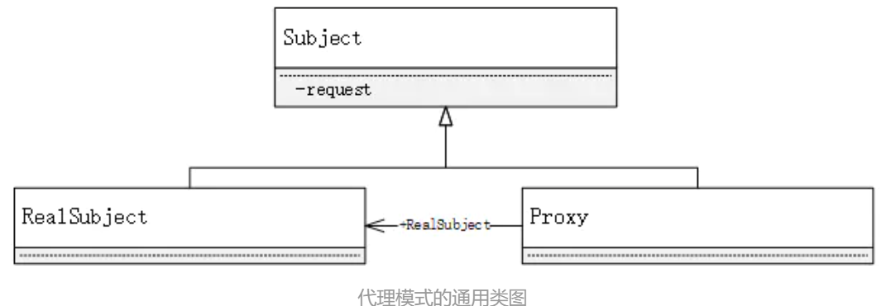

# 代理模式

---

## 定义

> 代理模式又叫委托模式 

为某个对象提供一个代理对象，并由代理对象控制对原对象的访问。



subject：抽象主题角色

Real Subject:具体主题角色，也叫被委托角色或真实角色

Proxy：代理主题角色，也叫委托类或者代理类

## 优缺

### 优点

* 可以使真实角色的操作更加纯粹，不用去关注一些公共的业务
* 公共交给代理角色，实现了业务的分工
* 公共业务发生扩展时更方便集中管理 

### 缺点

* 大量冗余类
* 不容易维护，接口更改代理类和目标类都要更改

## 静态代理

---

### 定义

通过明确的代理类来访问源对象

### 步骤

1. 接口

   ``` java
   public interface Rent {
       public void Rent();
   }
   ```

2. 真实角色

   ```java
   public class Host implements Rent{
       @Override
       public void Rent() {
           System.out.println("房东出租房子");
       }
   }
   ```

3. 代理角色

   ```java
   public class proxy implements Rent{
       private Host host;
       public proxy(){
           System.out.println("中介");
       }
       public proxy(Host host){
           System.out.println("通过中介");
           this.host =host;
       }
       
       public void seehouse(){
           System.out.println("看看房");
       }
       @Override
       public void Rent() {
           host.Rent();
       }
   }
   ```

4. 客户端访问代理

   ```java
   public class Client {
       public static void main(String[] args) {
           Host host = new Host();
           proxy proxy = new proxy(host);
           proxy.Rent();
           proxy.seehouse();
       }
   }
   ```

## 动态代理

---

* 动态代理的实现类是动态生成的

* 动态代理分为

  * 基于接口
    * JDK动态代理
  * 基于类
    * cglib

  * Java字节码实现：javasist

需要了解两个类：proxy ：代理 , InvocationHandler：调用处理程序

### InvocationHandler

